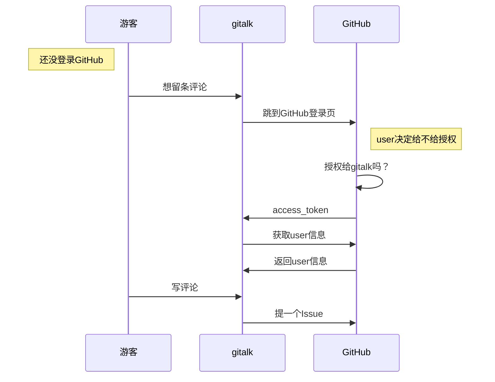
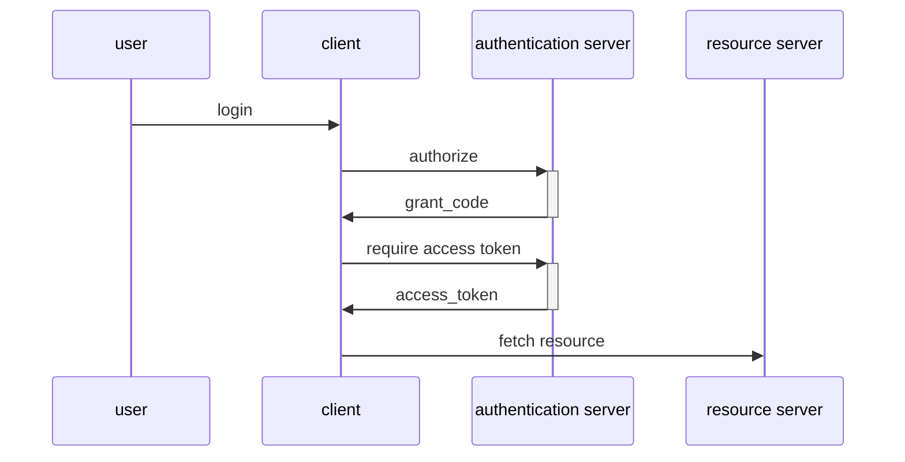

gitalk就是我现在用的评论工具，它基于GitHub Issue。集成倒是简单，对于git pages的博客来讲，算是很方便的评论系统了，只要有GitHub账号就可以留评论。不过使用之前还担心会对GitHub仓库带来隐患，下面是整个调查过程。
我不会介绍如何配置gitalk。我先介绍 OAuth 2 和 GitHub OAuth APPs，然后做一个demo来具体化 GitHub OAuth 认证流程，最后结合gitalk源码来看gitalk的实现。

## Gitalk 配置要求
按照说明[https://github.com/gitalk/gitalk](https://github.com/gitalk/gitalk)新建一个 OAuth App，然后配置几个参数即可。
```
clientID: 'GitHub Application Client ID',
clientSecret: 'GitHub Application Client Secret'
id: location.pathname
```
摘取关键参数做下简单介绍：
clientID: 唯一标识一个OAuth App，比如小赵和小钱都使用gitalk作为评论工具，那么gitalk怎么知道别人是在评论小赵的博客还是小钱的博客。
clientSecret：OAuth2.0协议的一环，用户允许授权后gitalk需要拿clientID+clientSecret+grant_code向GitHub索要该用户的access_token.
id: 每篇文章的唯一标识。每个评论就是一个Issue，gitalk提交Issue时会带着这个id作为tag参数，这样每篇文章在打开时根据这个tag获取Issue列表，作为博客下面的评论展示出来。
clientID区分哪个博客，id区分哪篇文章。

什么是OAuth APP呢？

## 什么是 GitHub OAuth Apps
GitHub有三类不同的token：
1. GitHub Apps
2. OAuth Apps
3. Personal access tokens

gitalk 使用的是OAuth这种，那我简单的把我的理解说一下，参考官网[https://developer.github.com/apps/about-apps/](https://developer.github.com/apps/about-apps/)。

1. GitHub Apps
它可以作为一个APP来使用， 比如我有10个repo，我建一个GitHub App来管理其中的3个repo，权限都是读写，我把小明也加入到这个App来，那么小明就有了对这3个repo的读写权限，即读写权限是属于APP，而不是属于我或小明。
2. OAuth Apps
实现了OAuth2.0认证协议，主要针对第三方平台想要通过GitHub API获取用户私密信息时，用户可不必向第三方平台提供GitHub账号密码即可完成认证。通过OAuth Apps授权的token代表的是该授权用户，而不是App，即App本身不具有任何权限。在权限限制上也与GitHub App不同，OAuth App只能读。值得一提的是GitHub使用的是Authorization code grant模式，也是最推荐的模式。以gitalk为例在该模式下的认证流程为：

这里的标签gitalk就是新创建的OAuth App。
3. Personal access token
与用账号密码登录的token类似，不同点在于可以设置权限范围，并且可随时revoke。

## 什么是 OAth2.0 协议
OAuth2 有4个角色：

1. 资源拥有者 (user)
2. 第三方客户端 (client)
3. 资源服务器 (resource server)
4. 认证服务器 (authentication server)

Authentication code grant 模式流程如下：

1. user在第三方平台A登录，登录方式是使用另一个平台B的身份信息。
2. A携带clientID跳转到B的授权页，请user授权。（这个clientID就是A在B登记的OAuth身份标识，这也表明使用OAuth协议前必须先在平台注册登记）
3. user授权A可以从B获取身份信息，grant_code作为凭据。
4. A的【**后台**】向B发起access_token申请，携带参数clientID+clientSecret+grant_code。
5. B验证无误后返回代表该用户的access_token。
6. A可以使用access_token通过B的API调取user信息了。

可以看出认证授权有两个阶段，这也是OAuth协议被认为安全的关键。第一阶段只能拿到一个临时许可令牌grant_code，可能十几分钟的过期。第二阶段拿access_token。

1. 第一阶段
clientID可以保存在前端，比如web页面，跳转认证时直接从前端取，不需要请求后台。grant_code只作为一个用户许可，并不能确保是否是可信任平台发起的请求，所以要验证平台是否可信，通过clientSecret。
2. 第二阶段
clientSecret只能保存在后台，而且获取access_token的请求只能由后台服务器发起和接收。这个过程跟前端无关，所以被认为是最安全的。

access_token一般会被保存起来，过期时间会久一些，可能几个月。

既然如此，是否可以说凡是使用OAuth2.0的认证就一定是最安全的呢？并不是，这要看是否使用的规范。gitalk就是一个不规范使用的例子，它把clientSecret也暴露在前端。接下来写一个demo来展示一下规范使用和不规范使用的区别。

## GitHub OAuth2 认证
新建一个OAuth Apps，`Authorization callback URL`填：
```
http://localhost:5000
```
### 规范示例
1. 创建 node project
`mkdir OAuth2Demo`
`cd OAuth2Demo`
`npm init -y`
2. 安装依赖
`npm install express`
`npm install axios`
3. 新建 server.js
```js
const express = require('express')
const app = express()

// Import the axios library, to make HTTP requests
const axios = require('axios')

// This is the client ID and client secret that you obtained
// while registering the application
const clientID = '6b2b6a2d87e8389e341a'
const clientSecret = '1e313e588e2ffc5b74146f6a5822e6afcce17b20'

// Declare the redirect route
app.get('/carl-zk/blog', (req, res) => {

  // The req.query object has the query params that were sent to this route.
  const requestToken = req.query.code
  
  axios({
    method: 'post',
    url: `https://github.com/login/oauth/access_token?client_id=${clientID}&client_secret=${clientSecret}&code=${requestToken}`,
    // Set the content type header, so that we get the response in JSON
    headers: {
         accept: 'application/json'
    }
    
  }).then((response) => {
    
    const accessToken = response.data.access_token
    console.log(response.data)
    
    // redirect the user to the home page, along with the access token
    res.redirect(`/home.html?access_token=${accessToken}`)
  })
})

app.use(express.static(__dirname + '/public'))
app.listen(5000,()=>{
    console.log("Server listening on port : 5000")
})

```
4. 运行
`node server.js`

5. 后台部署完成，配置前端页面
当前目录下新开一个终端窗口
`mkdir public`
`cd public`

新建两个html文件
index.html
```html
<!DOCTYPE html>
<html>

<body>
  <a href="https://github.com/login/oauth/authorize?client_id=6b2b6a2d87e8389e341a&redirect_uri=http://localhost:5000/carl-zk/blog">
    Login with github
  </a>
</body>

</html>
```
home.html
```html
<!DOCTYPE html>
<html lang="en">

<head>
    <meta charset="UTF-8">
    <meta name="viewport" content="width=device-width, initial-scale=1.0">
    <meta http-equiv="X-UA-Compatible" content="ie=edge">
    <title>Hello</title>
</head>

<body>
 <a href='http://localhost:5000'>back</a>
</body>
<script>
    // We can get the token from the "access_token" query
    // param, available in the browsers "location" global
    const query = window.location.search.substring(1)
  const token = query.split('access_token=')[1]

    // Call the user info API using the fetch browser library
    fetch('https://api.github.com/user', {
            headers: {
                // Include the token in the Authorization header
                Authorization: 'token ' + token
            }
        })
        // Parse the response as JSON
        .then(res => res.json())
        .then(res => {
            // Once we get the response (which has many fields)
            // Documented here: https://developer.github.com/v3/users/#get-the-authenticated-user
            // Write "Welcome <user name>" to the documents body
            const nameNode = document.createTextNode(`Welcome, ${res.name}`)
            document.body.appendChild(nameNode)
        })
</script>

</html>

```
目录结构为：
OAuth2Demo/
...server.js
...public/
......index.html
......home.html

说明：
- clientSecret保存在【后台】
- 用户从`index.html`页面GitHub登录，跳转到授权页，授权后跳转到`http://localhost:5000/carl-zk/blog`
- API接口`/carl-zk/blog`接收到请求后提取grant_code，调用GitHub获取access_token，然后跳转到前端页面`/home.html`并携带access_token，这个过程是【后台】完成的
- `/home.html`页面的script代码表示，页面打开时提取access_token，然后从GitHub获取user

6. 测试认证
<a href="http://localhost:5000" target="_blank">http://localhost:5000</a>
为了方便查看记录，可以先设置下Chrome的Network和Console，即使网页发生跳转也不清除任何记录：


依次出现的请求有：
1. 跳转到GitHub授权页
``` 
https://github.com/login/oauth/authorize?client_id=6b2b6a2d87e8389e341a&redirect_uri=http://localhost:5000/carl-zk/blog
```
HTTP Status 302,说明当请求完成后会发生跳转，即http://localhost:5000/carl-zk/blog
2. 授权成功，返回到指定URL，且携带grant code
```
http://localhost:5000/carl-zk/blog?code=5612e51bf4d1bd4c289d
```
HTTP Status 302，说明还要跳转，跳转地址在header的Location中，即/home.html?access_token=dc6d8739c3b3aa221c7991b0eda175d038637e65
3. 跳转到/home.html
```
http://localhost:5000/home.html?access_token=dc6d8739c3b3aa221c7991b0eda175d038637e65
```
Http Status 200, 说明请求完成。
4. 通过GitHub API获取用户信息
```
https://api.github.com/user
```
access_token 在header的Authorization中。

从1到3是一个完整的认证授权流程，获取grant code是从前端`index.html`发起的，获取access token是从后台发起的。

### 不规范示例
server.js
```js
const express = require('express')
const app = express()

app.use(express.static(__dirname + '/public'))
app.listen(5000,()=>{
    console.log("Server listening on port : 5000")
})
```
index.html
```html
<!DOCTYPE html>
<html>

<body>
  <a href="https://github.com/login/oauth/authorize?client_id=6b2b6a2d87e8389e341a&redirect_uri=http://localhost:5000/home.html">
    Login with github
  </a>
</body>

</html>

```
home.html
```html
<!DOCTYPE html>
<html lang="en">

<head>
    <meta charset="UTF-8">
    <meta name="viewport" content="width=device-width, initial-scale=1.0">
    <meta http-equiv="X-UA-Compatible" content="ie=edge">
    <title>Hello</title>
</head>

<body>
 <a href='http://localhost:5000'>back</a>
</body>
<script>
    var clientID = '6b2b6a2d87e8389e341a';
    var clientSecret = '1e313e588e2ffc5b74146f6a5822e6afcce17b20';

    const url = "https://github.com/login/oauth/access_token";
    const headers = new Headers()
    
    // 截取参数, 例如 'http://localhost:4000/?code=d184a514581e38c2f713'
    // 截取到 'code=d184a514581e38c2f713'
    const query = window.location.search.substring(1)
    if(query) {
        // 当前页面带有 grant code
        let code = query.split("code=")[1]

        headers.append("Content-Type", "application/json")
        headers.append("Accept", "application/json")
        const payload = { "client_id": clientID, "client_secret": clientSecret, "code": code}
        
        fetch(url, {
          method: 'POST', 
          headers: headers,
          body: JSON.stringify(payload),
        })
        .then((response) => response.json())
        .then((data) => {
            headers.append('Authorization', 'token ' + data.access_token)
            fetch('https://api.github.com/user', {
                method: 'GET',
                headers: headers
            })
            .then(res => res.json())
            .then(res => {
                const nameNode = document.createTextNode(`Welcome, ${res.name}`)
        document.body.appendChild(nameNode)
            })
        })
    }
</script>

</html>

```

改动：
- clientSecret保存在前端
- 授权后跳转到前端页面`/home.html`
- 从`home.html`的script中发起access_token请求

请求依次为：
1. 跳转到授权页，授权后跳转到 home.html 页面
```
https://github.com/login/oauth/authorize?client_id=6b2b6a2d87e8389e341a&redirect_uri=http://localhost:5000/home.html
```
HTTP Status 302
2. home.html 页面，携带grant code
```
http://localhost:5000/home.html?code=17ac33b2893f2d038dbb
```
HTTP Status 200，再无跳转
3. 申请access token
```
https://github.com/login/oauth/access_token
```
申请失败，请求无法完成，查看Console信息如下：

原因是这个接口禁止跨域请求，如果用Postman去请求就可以获取。解决方法是找个代理服务器转发，代理服务器再把access_token返回给我们。
使用[https://github.com/Rob--W/cors-anywhere](https://github.com/Rob--W/cors-anywhere)作为代理服务器，启动在3000端口：

```sh
git clone git@github.com:Rob--W/cors-anywhere.git
cd cors-anywhere
npm install
export PORT=3000
node server.js
```
home.html 改动：
```
const proxy = "http://localhost:3000/"
const url = proxy + "https://github.com/login/oauth/access_token";
```

再次请求：
3. 申请access_token
```
http://localhost:3000/https://github.com/login/oauth/access_token
```
HTTP Status 200，获取成功
4. 获取user
```
https://api.github.com/user
```

使用代理服务器解决了`github.com/login/oauth/access_token`不能跨域请求问题，代理服务器本质上属于后端服务器，所以不存在跨域问题。

从1到3都是前端完成，无后台server。缺点是暴露了clientSecret，不符合OAuth2.0规范。但是在GitHub上这样做是安全的，因为access_token只有读权限，不能对user的repo造成任何损害。

## 结合 Gitalk 源码
gitalk没有后台server，clientSecret也是保存在前端，很明显它使用的是不规范的那种方式。下面根据源码找下它的代理服务器地址。
gitalk的代码在[https://github.com/gitalk/gitalk/blob/master/src/gitalk.jsx](https://github.com/gitalk/gitalk/blob/master/src/gitalk.jsx)
使用的代理为[https://github.com/gitalk/gitalk/blob/ab55125516b418e2bd9bb6ace44c6df4750a175a/src/gitalk.jsx#L63](https://github.com/gitalk/gitalk/blob/ab55125516b418e2bd9bb6ace44c6df4750a175a/src/gitalk.jsx#L63)
```
proxy: 'https://cors-anywhere.herokuapp.com/https://github.com/login/oauth/access_token',
```
一个公开的免费代理，声称是不会保存任何转发信息。

下面简单介绍几个方法：
1. access_token
[https://github.com/gitalk/gitalk/blob/ab55125516b418e2bd9bb6ace44c6df4750a175a/src/gitalk.jsx#L153-L159](https://github.com/gitalk/gitalk/blob/ab55125516b418e2bd9bb6ace44c6df4750a175a/src/gitalk.jsx#L153-L159)
```js
get accessToken () {
return this._accessToke || window.localStorage.getItem(GT_ACCESS_TOKEN)
}
set accessToken (token) {
window.localStorage.setItem(GT_ACCESS_TOKEN, token)
this._accessToken = token
}
```
access_token获取之后被保存起来，不关闭浏览器是不需要重复授权的。
2. comments
[https://github.com/gitalk/gitalk/blob/ab55125516b418e2bd9bb6ace44c6df4750a175a/src/gitalk.jsx#L267-L272](https://github.com/gitalk/gitalk/blob/ab55125516b418e2bd9bb6ace44c6df4750a175a/src/gitalk.jsx#L267-L272)
```js
  createIssue () {
    const { owner, repo, title, body, id, labels, url } = this.options
    return axiosGithub.post(`/repos/${owner}/${repo}/issues`, {
      title,
      labels: labels.concat(id),
      body: body || `${url} \n\n ${
```
注意labels后面连接的id，这个id就是文章的唯一标识，一般设置为URL。
GitHub的label长度限制在63字符之内，超过就不能创建Issue。为此可以对URL进行md5哈希，md5后生成128-bit摘要，用16进制表示，长度恒等于32.
Issues获取也是根据labels，不同文章的id不同，获取的列表自然也就不同，把Issues作为评论展示出来，这样一个简单的评论系统就完成了。

## 结论
虽然gitalk使用了第三方代理服务器来获取access_token属于违反OAuth2.0规范，但是作为一个评论系统来说安全性可以不必担心，因为GitHub已经对access_token做了只读限制。希望这篇文章对你理解gitalk有所帮助，也欢迎留评论。

附：[demo code](/blog/2020/03/03/gitalk-%E8%BF%90%E4%BD%9C%E5%8E%9F%E7%90%86/code.txt)
[初始化Comment脚本 python](https://github.com/carl-zk/blog/blob/master/init_comments.py)

## 参考
[https://medium.com/shriram-navaratnalingam/authentication-using-github-oauth-2-0-with-nodejs-be1091ce10a7](https://medium.com/shriram-navaratnalingam/authentication-using-github-oauth-2-0-with-nodejs-be1091ce10a7)
