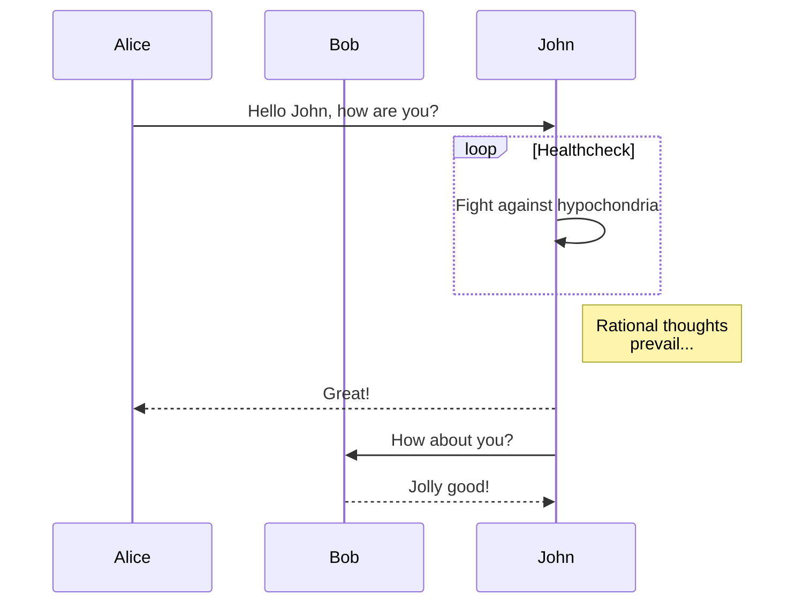

>学习一种编程语言的好方法，我个人觉得是边看官网文档，边使用。以 Python 为例，先简单浏览一下官网的入门文档，了解语言和语法特点（语法简单不、跨平台不、性能好不、编译型 or 解释型、对象回收手动 or 自动、内存管理（对象都放在哪）、哪些内置数据结构（基础类型和集合类型）、值传递 or 引用传递、深拷贝和浅拷贝、适用于）。简单学习了语法后，去 LeetCode 找俩简单题，不知道如何创建 list 或 dictionaries ，可以打开 w3c 网站。切忌想着等看完所有入门文档再 code ，读文档不必一口气看完，可以分散开；也不必先下个 IDE 和查 API 或看源码，这等你看完入门文档了再弄不迟，你要相信你始终会掌握该语言下的那个最好的 IDE 并熟练的敲快捷键跟查源码/API的。
编程语言只是实现你想法的工具，没有高低之分，使用 C 并不比使用 Java 的更高贵。你选择编程，无非是被它绚丽的外表所吸引，通过它实现你内心的想法。语言的不同只是语法糖的不同，不要沦为糖衣的工具，要记住你第一次踏进编程的时候的心情，抱着追逐梦想的初心。哪个插件/软件你觉得不爽，哪个东西你想做却迟迟没有动手，碍于这个或那个语言没学过，这就把你的初心渐渐遗忘了。会编程并不代表你成了 creator，你只是增加了成为 creator 的可能性，因为你掌握了创造软件的工具。
总之，做点有意思的事，做有意义的事。 

## Python3

- from collections import defaultdict, Counter
defaultdict 比普通dict多一个默认工厂，当key不存在时返回工厂值
    """
    defaultdict(default_factory[, ...]) --> dict with default factory
    
    The default factory is called without arguments to produce
    a new value when a key is not present, in __getitem__ only.
    A defaultdict compares equal to a dict with the same items.
    All remaining arguments are treated the same as if they were
    passed to the dict constructor, including keyword arguments.
    """
例如：
defaultdict(list)
[2242. Maximum Score of a Node Sequence](https://leetcode.com/problems/maximum-score-of-a-node-sequence/)

Counter 统计相同元素个数到dict中
    '''
    Dict subclass for counting hashable items.  Sometimes called a bag
    or multiset.  Elements are stored as dictionary keys and their counts
    are stored as dictionary values.

    >>> c = Counter('abcdeabcdabcaba')  # count elements from a string

    >>> c.most_common(3)                # three most common elements
    [('a', 5), ('b', 4), ('c', 3)]
    >>> sorted(c)                       # list all unique elements
    ['a', 'b', 'c', 'd', 'e']
    >>> ''.join(sorted(c.elements()))   # list elements with repetitions
    'aaaaabbbbcccdde'
    >>> sum(c.values())                 # total of all counts
    15

    >>> c['a']                          # count of letter 'a'
    5
    >>> for elem in 'shazam':           # update counts from an iterable
    ...     c[elem] += 1                # by adding 1 to each element's count
    >>> c['a']                          # now there are seven 'a'
    7
    >>> del c['b']                      # remove all 'b'
    >>> c['b']                          # now there are zero 'b'
    0

    >>> d = Counter('simsalabim')       # make another counter
    >>> c.update(d)                     # add in the second counter
    >>> c['a']                          # now there are nine 'a'
    9

    >>> c.clear()                       # empty the counter
    >>> c
    Counter()

    Note:  If a count is set to zero or reduced to zero, it will remain
    in the counter until the entry is deleted or the counter is cleared:

    >>> c = Counter('aaabbc')
    >>> c['b'] -= 2                     # reduce the count of 'b' by two
    >>> c.most_common()                 # 'b' is still in, but its count is zero
    [('a', 3), ('c', 1), ('b', 0)]

    '''

[2244. Minimum Rounds to Complete All Tasks](https://leetcode.com/problems/minimum-rounds-to-complete-all-tasks/discuss/1955622/JavaC%2B%2BPython-Sum-up-(freq-%2B-2)-3)

- from heapq import nlargest
    """
    Find the n largest elements in a dataset.

    Equivalent to:  sorted(iterable, key=key, reverse=True)[:n]
    """

- from itertools import product
    """
    product(*iterables, repeat=1) --> product object
    
    Cartesian product of input iterables.  Equivalent to nested for-loops.
    
    For example, product(A, B) returns the same as:  ((x,y) for x in A for y in B).
    The leftmost iterators are in the outermost for-loop, so the output tuples
    cycle in a manner similar to an odometer (with the rightmost element changing
    on every iteration).
    
    To compute the product of an iterable with itself, specify the number
    of repetitions with the optional repeat keyword argument. For example,
    product(A, repeat=4) means the same as product(A, A, A, A).
    
    product('ab', range(3)) --> ('a',0) ('a',1) ('a',2) ('b',0) ('b',1) ('b',2)
    product((0,1), (0,1), (0,1)) --> (0,0,0) (0,0,1) (0,1,0) (0,1,1) (1,0,0) ...
    """

## TODO

| Type | Python | Java |
| --- | --- | --- |
| numeric | int | Integer |

