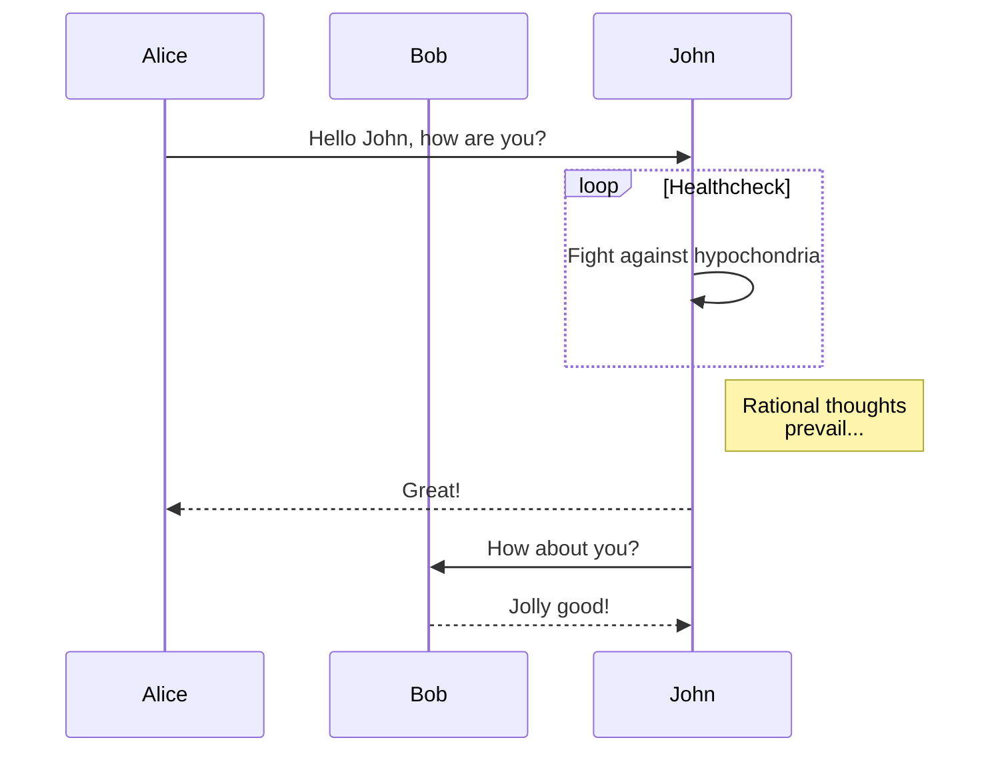

>学习一种编程语言的好方法，我个人觉得是边看官网文档，边使用。以 Python 为例，先简单浏览一下官网的入门文档，了解语言和语法特点（语法简单不、跨平台不、性能好不、编译型 or 解释型、对象回收手动 or 自动、内存管理（对象都放在哪）、哪些内置数据结构（基础类型和集合类型）、值传递 or 引用传递、深拷贝和浅拷贝、适用于）。简单学习了语法后，去 LeetCode 找俩简单题，不知道如何创建 list 或 dictionaries ，可以打开 w3c 网站。切忌想着等看完所有入门文档再 code ，读文档不必一口气看完，可以分散开；也不必先下个 IDE 和查 API 或看源码，这等你看完入门文档了再弄不迟，你要相信你始终会掌握该语言下的那个最好的 IDE 并熟练的敲快捷键跟查源码/API的。
编程语言只是实现你想法的工具，没有高低之分，使用 C 并不比使用 Java 的更高贵。你选择编程，无非是被它绚丽的外表所吸引，通过它实现你内心的想法。语言的不同只是语法糖的不同，不要沦为糖衣的工具，要记住你第一次踏进编程的时候的心情，抱着追逐梦想的初心。哪个插件/软件你觉得不爽，哪个东西你想做却迟迟没有动手，碍于这个或那个语言没学过，这就把你的初心渐渐遗忘了。会编程并不代表你成了 creator，你只是增加了成为 creator 的可能性，因为你掌握了创造软件的工具。
总之，做点有意思的事，做有意义的事。 

## TODO

| Type | Python | Java |
| --- | --- | --- |
| numeric | int | Integer |

