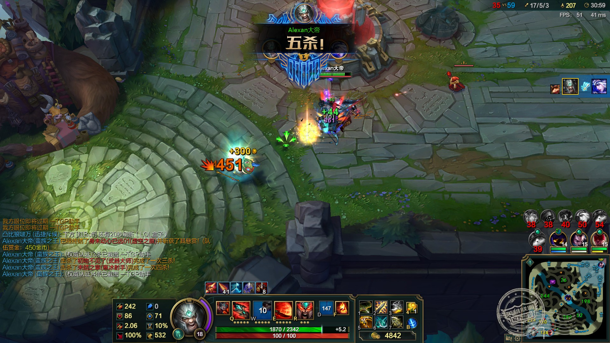

> 工程师，主后端，擅长java，好奇心强。
> 最爱科幻，文学小说，脱口秀，结交有趣的人。
> 想成为大牛，读完那个永远读不完的书单。

### *我在尝试跟自己和解，习惯做一个孤独的人*

刷题：
2021.3.3,leetCode,965

> ### 红楼梦
>> ##### 好了歌
>>世人都晓神仙好，惟有功名忘不了！
古今将相在何方？荒冢一堆草没了。
世人都晓神仙好，只有金银忘不了！
终朝只恨聚无多，及到多时眼闭了。
世人都晓神仙好，只有姣妻忘不了！
君生日日说恩情，君死又随人去了。
世人都晓神仙好，只有儿孙忘不了！
痴心父母古来多，孝顺子孙谁见了？

---

<h4>荣誉截图</h4>

